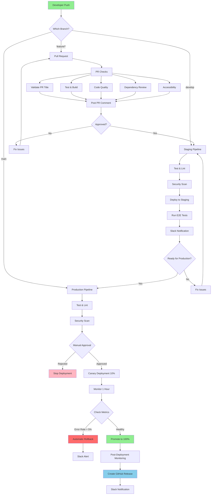
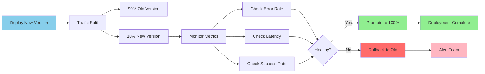
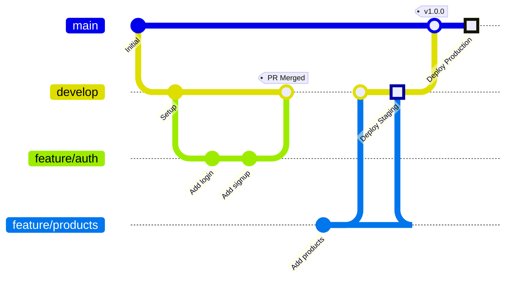
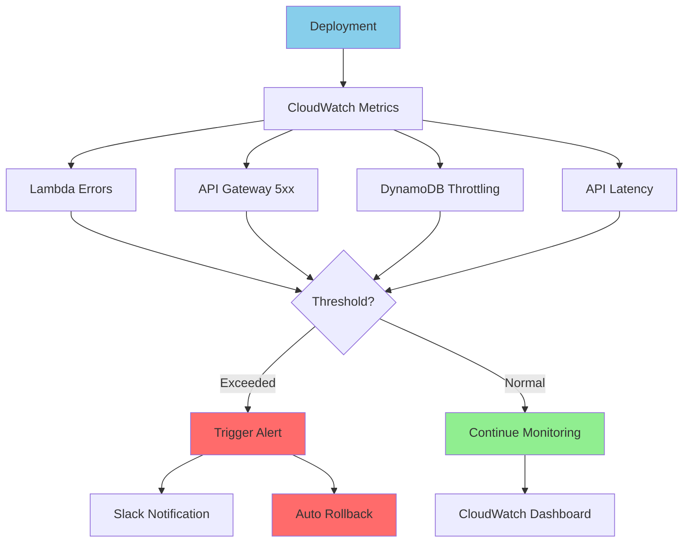
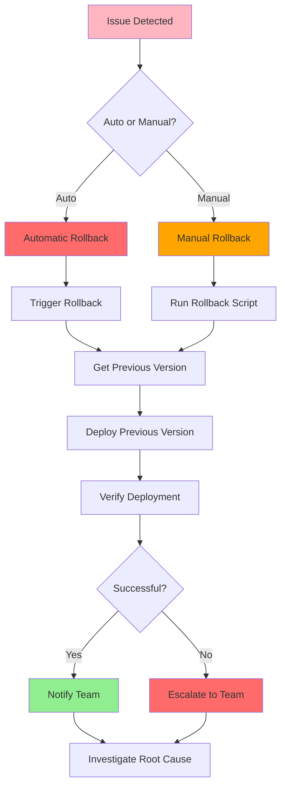
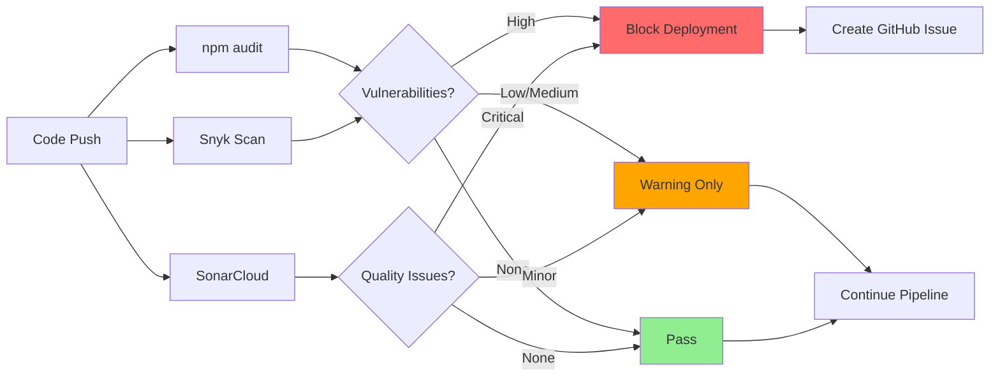
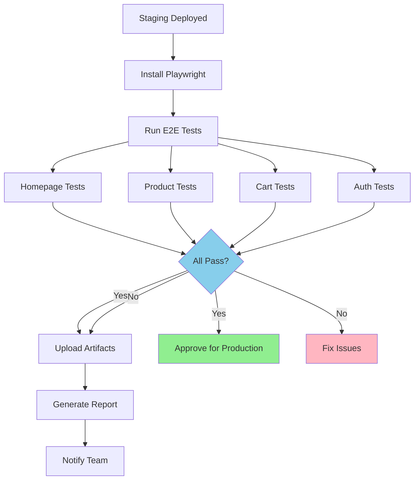

# CI/CD Pipeline Diagram

## Complete Pipeline Flow

## Canary Deployment Detail

## Branch Strategy

## Deployment Timeline

```mermaid
gantt
    title Production Deployment Timeline
    dateFormat HH:mm
    axisFormat %H:%M
    
    section Pre-Deploy
    Tests & Build           :done, 00:00, 5m
    Security Scan          :done, 00:05, 3m
    Manual Approval        :done, 00:08, 10m
    
    section Canary
    Deploy 10%             :active, 00:18, 2m
    Monitor Metrics        :active, 00:20, 60m
    
    section Promotion
    Promote to 100%        :crit, 01:20, 5m
    Post-Deploy Monitor    :01:25, 5m
    Create Release         :01:30, 2m
```

## Monitoring Flow

## Rollback Process

## Security Scanning Flow

## E2E Testing Flow

## Legend

- 🟢 Green: Success/Healthy
- 🔴 Red: Error/Rollback
- 🟡 Yellow: Warning/Manual Action
- 🔵 Blue: In Progress/Active
- 🟣 Purple: Highlight/Important
