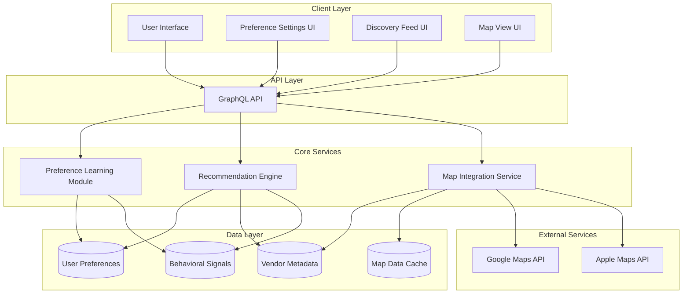

# Design Document: AI-Powered Personalized Discovery

## Overview

This design outlines an AI-powered recommendation system that learns user preferences through behavioral signals and explicit inputs to deliver personalized vendor and product discovery. The system integrates with Google Maps and Apple Maps APIs to enrich vendor metadata, uses a weighted scoring algorithm to match vendors with user preferences, and continuously improves through feedback loops.

The architecture follows a modular approach with three core subsystems:
1. **Preference Learning Module** - Captures and processes behavioral signals
2. **Map Integration Service** - Enriches vendor data with external map services
3. **AI Recommendation Engine** - Generates personalized recommendations using weighted scoring

## Architecture

### High-Level System Architecture



### Data Flow

1. **Behavioral Signal Capture**: User actions (orders, favorites, views, reviews) trigger events that flow to the Preference Learning Module
2. **Preference Extraction**: The module processes signals and updates the user's preference profile with weighted attributes
3. **Vendor Enrichment**: Map Integration Service periodically fetches and caches vendor data from external APIs
4. **Recommendation Generation**: When a user requests recommendations, the engine calculates match scores between the user's profile and available vendors
5. **Feedback Loop**: User interactions with recommendations (thumbs up/down, dismissals) feed back into the learning module

## Components and Interfaces

### 1. User Preference Profile Schema

Stored in DynamoDB, linked to Customer records:

```typescript
interface UserPreferenceProfile {
  userId: string;
  
  // Explicit preferences (user-defined, higher weight)
  explicitPreferences: {
    cuisineTypes: CuisinePreference[];
    businessType: 'family-owned' | 'independent' | 'chain' | 'no-preference';
    ambiancePreference: 'hole-in-the-wall' | 'casual' | 'upscale' | 'fine-dining' | 'no-preference';
    authenticityPreference: 'traditional' | 'fusion' | 'modern' | 'no-preference';
  };
  
  // Inferred preferences (behavior-based, lower weight)
  inferredPreferences: {
    cuisineWeights: Record<string, number>; // e.g., { "mexican": 0.85, "chinese": 0.72 }
    priceRangePreference: { min: number; max: number; weight: number };
    businessTypeWeights: Record<string, number>;
    ambianceWeights: Record<string, number>;
  };
  
  // Behavioral history
  behavioralSignals: {
    totalOrders: number;
    favoriteVendorIds: string[];
    viewedVendorIds: string[];
    positiveReviewVendorIds: string[];
    negativeReviewVendorIds: string[];
  };
  
  // Feedback on recommendations
  recommendationFeedback: {
    thumbsUpVendorIds: string[];
    thumbsDownVendorIds: string[];
    dismissedVendorIds: string[];
    feedbackCount: number;
  };
  
  // Metadata
  lastUpdated: string;
  profileCompleteness: number; // 0-100 score
  createdAt: string;
}

interface CuisinePreference {
  type: string; // e.g., "mexican", "chinese", "latin-american"
  weight: number; // 0-1, user-defined preferences get 1.0
}
```

### 2. Vendor Metadata Schema

Extended Vendor model with AI-relevant attributes:

```typescript
interface VendorMetadata {
  vendorId: string;
  
  // Business attributes (vendor-provided)
  cuisineTypes: string[]; // ["mexican", "latin-american"]
  businessType: 'family-owned' | 'independent' | 'chain';
  ambianceType: 'hole-in-the-wall' | 'casual' | 'upscale' | 'fine-dining';
  authenticityLevel: 'traditional' | 'fusion' | 'modern';
  
  // Map service data
  googleMapsData: {
    placeId: string;
    rating: number;
    reviewCount: number;
    priceLevel: number; // 1-4
    types: string[]; // Google's place types
    lastUpdated: string;
  } | null;
  
  appleMapsData: {
    placeId: string;
    rating: number;
    reviewCount: number;
    category: string;
    lastUpdated: string;
  } | null;
  
  // Computed scores
  authenticityScore: number; // 0-1, computed from reviews, vendor input, map data
  popularityScore: number; // 0-1, based on orders, reviews, ratings
  
  // Metadata
  lastEnriched: string;
}
```

### 3. Preference Learning Module

Lambda function that processes behavioral signals:

```typescript
interface PreferenceLearningModule {
  // Event handlers
  onOrderPlaced(order: Order): Promise<void>;
  onVendorFavorited(userId: string, vendorId: string): Promise<void>;
  onVendorViewed(userId: string, vendorId: string, duration: number): Promise<void>;
  onReviewSubmitted(review: Review): Promise<void>;
  onRecommendationFeedback(userId: string, vendorId: string, feedback: 'thumbs-up' | 'thumbs-down' | 'dismissed'): Promise<void>;
  
  // Preference extraction
  extractCuisinePreferences(vendorId: string): Promise<string[]>;
  updatePreferenceWeights(userId: string, attributes: Record<string, number>, delta: number): Promise<void>;
  
  // Profile management
  getOrCreateProfile(userId: string): Promise<UserPreferenceProfile>;
  calculateProfileCompleteness(profile: UserPreferenceProfile): number;
}
```

**Weight Update Logic**:
- Order placed: +0.15 to cuisine types, +0.10 to business type/ambiance
- Vendor favorited: +0.20 to all vendor attributes
- Vendor viewed (>30s): +0.05 to all vendor attributes
- Positive review (4-5 stars): +0.20 to all vendor attributes
- Negative review (1-2 stars): -0.15 to all vendor attributes
- Thumbs up on recommendation: +0.10 to similar vendors
- Thumbs down on recommendation: -0.15 to similar vendors
- Dismissed recommendation: -0.03 to similar vendors

Weights are normalized to 0-1 range after each update.

### 4. Map Integration Service

Lambda function for enriching vendor data:

```typescript
interface MapIntegrationService {
  // Vendor enrichment
  enrichVendor(vendorId: string): Promise<VendorMetadata>;
  refreshStaleData(): Promise<void>; // Runs daily via EventBridge
  
  // API integrations
  fetchGoogleMapsData(address: string, businessName: string): Promise<GoogleMapsData>;
  fetchAppleMapsData(address: string, businessName: string): Promise<AppleMapsData>;
  
  // Rate limiting and caching
  queueAPIRequest(request: APIRequest): Promise<void>;
  getCachedMapData(vendorId: string): Promise<MapData | null>;
}
```

**API Integration Details**:

- **Google Maps Places API**:
  - Use Place Search to find place by name and address
  - Fetch Place Details for rating, reviews, price level, types
  - Cache results for 7 days
  - Rate limit: 100 requests per second (use queue with exponential backoff)

- **Apple Maps API** (MapKit JS):
  - Use Search API to find place
  - Fetch place details for rating, category
  - Cache results for 7 days
  - Rate limit: Handle 429 responses with retry logic

### 5. AI Recommendation Engine

Lambda function that generates personalized recommendations:

```typescript
interface RecommendationEngine {
  // Main recommendation generation
  generateRecommendations(
    userId: string,
    latitude: number,
    longitude: number,
    limit: number
  ): Promise<RecommendationResult[]>;
  
  // Scoring algorithm
  calculateMatchScore(
    userProfile: UserPreferenceProfile,
    vendor: VendorMetadata
  ): MatchScore;
  
  // Fallback for new users
  getPopularVendors(
    latitude: number,
    longitude: number,
    limit: number
  ): Promise<VendorMetadata[]>;
  
  // Explanation generation
  generateExplanation(
    userProfile: UserPreferenceProfile,
    vendor: VendorMetadata,
    matchScore: MatchScore
  ): string;
}

interface MatchScore {
  totalScore: number; // 0-100
  breakdown: {
    cuisineMatch: number;
    businessTypeMatch: number;
    ambianceMatch: number;
    authenticityMatch: number;
    locationScore: number;
    popularityBonus: number;
  };
}

interface RecommendationResult {
  vendor: VendorMetadata;
  matchScore: MatchScore;
  explanation: string;
  distance: number; // miles
}
```

**Scoring Algorithm**:

```typescript
function calculateMatchScore(
  userProfile: UserPreferenceProfile,
  vendor: VendorMetadata
): MatchScore {
  let totalScore = 0;
  const breakdown = {
    cuisineMatch: 0,
    businessTypeMatch: 0,
    ambianceMatch: 0,
    authenticityMatch: 0,
    locationScore: 0,
    popularityBonus: 0,
  };
  
  // 1. Cuisine matching (40% weight)
  const cuisineScore = calculateCuisineScore(userProfile, vendor);
  breakdown.cuisineMatch = cuisineScore;
  totalScore += cuisineScore * 0.4;
  
  // 2. Business type matching (25% weight)
  const businessScore = calculateBusinessTypeScore(userProfile, vendor);
  breakdown.businessTypeMatch = businessScore;
  totalScore += businessScore * 0.25;
  
  // 3. Ambiance matching (20% weight)
  const ambianceScore = calculateAmbianceScore(userProfile, vendor);
  breakdown.ambianceMatch = ambianceScore;
  totalScore += ambianceScore * 0.2;
  
  // 4. Authenticity matching (15% weight)
  const authenticityScore = calculateAuthenticityScore(userProfile, vendor);
  breakdown.authenticityMatch = authenticityScore;
  totalScore += authenticityScore * 0.15;
  
  // 5. Popularity bonus (up to +10 points)
  const popularityBonus = vendor.popularityScore * 10;
  breakdown.popularityBonus = popularityBonus;
  totalScore += popularityBonus;
  
  return { totalScore: Math.min(totalScore, 100), breakdown };
}
```

**Explanation Generation**:

```typescript
function generateExplanation(
  userProfile: UserPreferenceProfile,
  vendor: VendorMetadata,
  matchScore: MatchScore
): string {
  const reasons: string[] = [];
  
  // Top matching attributes
  if (matchScore.breakdown.cuisineMatch > 70) {
    const topCuisines = vendor.cuisineTypes.slice(0, 2).join(' and ');
    reasons.push(`Serves ${topCuisines} cuisine you love`);
  }
  
  if (matchScore.breakdown.businessTypeMatch > 80 && vendor.businessType === 'family-owned') {
    reasons.push('Family-owned business');
  }
  
  if (matchScore.breakdown.ambianceMatch > 70 && vendor.ambianceType === 'hole-in-the-wall') {
    reasons.push('Authentic hole-in-the-wall spot');
  }
  
  if (matchScore.breakdown.authenticityMatch > 80) {
    reasons.push('Known for traditional, authentic cooking');
  }
  
  if (vendor.googleMapsData && vendor.googleMapsData.rating >= 4.5) {
    reasons.push(`Highly rated (${vendor.googleMapsData.rating}★)`);
  }
  
  return reasons.slice(0, 3).join(' • ');
}
```

### 6. GraphQL API Extensions

New queries and mutations:

```graphql
# Queries
type Query {
  getPersonalizedRecommendations(
    latitude: Float!
    longitude: Float!
    limit: Int
  ): PersonalizedRecommendationsResult!
  
  getUserPreferenceProfile: UserPreferenceProfile
}

# Mutations
type Mutation {
  updateExplicitPreferences(
    cuisineTypes: [CuisinePreferenceInput!]
    businessType: String
    ambiancePreference: String
    authenticityPreference: String
  ): UserPreferenceProfile!
  
  submitRecommendationFeedback(
    vendorId: ID!
    feedback: RecommendationFeedback!
  ): Boolean!
  
  deletePreferenceProfile: Boolean!
}

# Types
type PersonalizedRecommendationsResult {
  recommendations: [VendorRecommendation!]!
  userProfileCompleteness: Int!
  isPersonalized: Boolean!
}

type VendorRecommendation {
  vendor: Vendor!
  matchScore: Int!
  explanation: String!
  distance: Float!
}

enum RecommendationFeedback {
  THUMBS_UP
  THUMBS_DOWN
  DISMISSED
}
```

## Data Models

### Database Tables

**UserPreferences Table** (DynamoDB):
- Partition Key: `userId` (String)
- Attributes: All fields from `UserPreferenceProfile` interface
- GSI: None needed (single-item lookups only)

**VendorMetadata Table** (DynamoDB):
- Partition Key: `vendorId` (String)
- Attributes: All fields from `VendorMetadata` interface
- GSI: `lastEnriched-index` for finding stale data to refresh

**BehavioralSignals Table** (DynamoDB):
- Partition Key: `userId` (String)
- Sort Key: `timestamp#eventType` (String)
- Attributes: `vendorId`, `productId`, `eventType`, `metadata`, `timestamp`
- TTL: 90 days (for GDPR compliance)
- Used for detailed analytics and preference recalculation

### Schema Updates

Extend existing `Vendor` model:

```typescript
Vendor: a.model({
  // ... existing fields ...
  
  // New AI-related fields
  cuisineTypes: a.string().array(),
  businessType: a.enum(['FAMILY_OWNED', 'INDEPENDENT', 'CHAIN']),
  ambianceType: a.enum(['HOLE_IN_THE_WALL', 'CASUAL', 'UPSCALE', 'FINE_DINING']),
  authenticityLevel: a.enum(['TRADITIONAL', 'FUSION', 'MODERN']),
  googleMapsPlaceId: a.string(),
  appleMapsPlaceId: a.string(),
  authenticityScore: a.float(),
  popularityScore: a.float(),
  lastMapDataUpdate: a.datetime(),
})
```

Extend existing `Customer` model:

```typescript
Customer: a.model({
  // ... existing fields ...
  
  // Link to preference profile
  hasPreferenceProfile: a.boolean().default(false),
})
```

## Error Handling

### Map API Failures

- **Google Maps API unavailable**: Fall back to cached data, log error, retry after 5 minutes
- **Apple Maps API unavailable**: Fall back to cached data, continue with Google data only
- **Rate limit exceeded**: Queue requests, implement exponential backoff (1s, 2s, 4s, 8s)
- **Invalid address**: Log warning, mark vendor for manual review, skip enrichment

### Recommendation Engine Failures

- **User has no preference profile**: Use popular vendors fallback
- **No vendors match criteria**: Relax matching thresholds by 20%, show best available
- **Scoring calculation error**: Log error, exclude problematic vendor, continue with others

### Data Consistency

- **Stale map data**: Refresh asynchronously, serve stale data until refresh completes
- **Missing vendor metadata**: Use defaults (authenticity: 0.5, popularity: 0.3)
- **Preference profile corruption**: Reset to defaults, notify user, log incident

## Testing Strategy

### Unit Tests

1. **Preference Learning Module**:
   - Test weight calculations for each event type
   - Test weight normalization
   - Test profile completeness calculation
   - Test edge cases (negative weights, overflow)

2. **Recommendation Engine**:
   - Test scoring algorithm with various user profiles
   - Test explanation generation
   - Test fallback logic for new users
   - Test ranking and sorting

3. **Map Integration Service**:
   - Mock API responses
   - Test rate limiting logic
   - Test cache hit/miss scenarios
   - Test error handling

### Integration Tests

1. **End-to-end recommendation flow**:
   - Create user with specific preferences
   - Create vendors with matching/non-matching attributes
   - Verify correct recommendations returned
   - Verify explanations are accurate

2. **Behavioral signal processing**:
   - Simulate user actions (orders, favorites, reviews)
   - Verify preference profile updates correctly
   - Verify recommendations adapt over time

3. **Map API integration**:
   - Test with real API calls (in staging)
   - Verify data parsing and storage
   - Test refresh logic

### Performance Tests

1. **Recommendation generation latency**: Target <500ms for 20 recommendations
2. **Concurrent user load**: Test 1000 simultaneous recommendation requests
3. **Map API rate limiting**: Verify queue handles 1000 vendors/hour enrichment
4. **Database query performance**: Ensure single-digit millisecond lookups

### User Acceptance Testing

1. **Preference accuracy**: Survey users on recommendation relevance (target >80% satisfaction)
2. **Explanation clarity**: Verify users understand why vendors are recommended
3. **Discovery effectiveness**: Track conversion rate from recommendation to order
4. **Privacy concerns**: Verify users feel comfortable with data collection

## Security and Privacy

### Data Protection

- All preference data encrypted at rest using AWS KMS
- Preference profiles never shared with vendors or third parties
- Behavioral signals have 90-day TTL for GDPR compliance
- Users can view and delete their preference profile at any time

### API Security

- Map API keys stored in AWS Secrets Manager
- API keys rotated every 90 days
- Rate limiting enforced at API Gateway level
- All API calls logged for audit

### User Controls

- Opt-out option for behavioral learning (use explicit preferences only)
- Clear data deletion process (GDPR right to be forgotten)
- Transparency dashboard showing what data is collected
- Preference export functionality (GDPR data portability)

## Performance Optimization

### Caching Strategy

- **User preference profiles**: Cache in Lambda memory for 5 minutes
- **Vendor metadata**: Cache in Lambda memory for 15 minutes
- **Map API responses**: Cache in DynamoDB for 7 days
- **Recommendation results**: Cache in CloudFront for 5 minutes per user/location

### Database Optimization

- Use DynamoDB on-demand pricing for unpredictable traffic
- Implement batch writes for behavioral signals
- Use DynamoDB Streams for async preference updates
- Partition behavioral signals by userId for efficient queries

### Lambda Optimization

- Provision concurrency for recommendation engine (10 instances)
- Use Lambda layers for shared dependencies (AWS SDK, utilities)
- Implement connection pooling for DynamoDB
- Set appropriate memory (1024MB) and timeout (30s) limits

## Monitoring and Observability

### Key Metrics

- **Recommendation quality**: Click-through rate, order conversion rate
- **System performance**: P50/P95/P99 latency, error rate
- **User engagement**: Preference profile completion rate, feedback submission rate
- **Map API health**: Success rate, rate limit hits, cache hit ratio

### Alarms

- Recommendation latency >1s for 5 minutes
- Error rate >5% for 5 minutes
- Map API failure rate >20% for 10 minutes
- Preference profile corruption detected

### Dashboards

- Real-time recommendation performance dashboard
- User preference analytics dashboard
- Map API usage and cost dashboard
- A/B test results dashboard (personalized vs. non-personalized)

## Future Enhancements

1. **Deep learning model**: Replace weighted scoring with neural network for better accuracy
2. **Collaborative filtering**: "Users like you also enjoyed..."
3. **Time-based preferences**: Learn that user prefers Mexican for lunch, Chinese for dinner
4. **Social proof**: Incorporate friends' preferences and orders
5. **Multi-modal learning**: Analyze food images from reviews to understand preferences
6. **Voice preferences**: "Find me authentic hole-in-the-wall tacos nearby"
