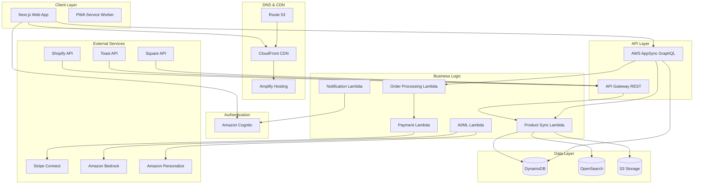
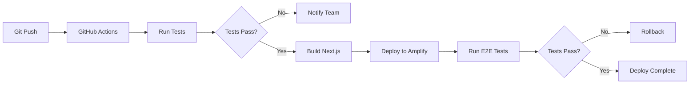
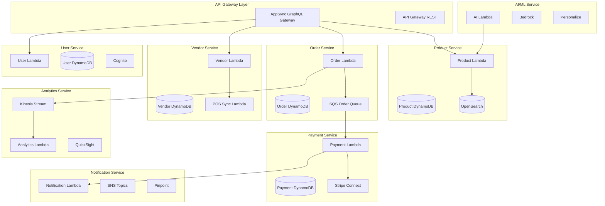

# Design Document

## Overview

Makeriess is a modern local marketplace platform built with Next.js 14 (App Router), AWS Amplify Gen 2, and a serverless AWS backend. The architecture follows a JAMstack approach with static generation where possible, server-side rendering for dynamic content, and real-time data synchronization through GraphQL subscriptions.

The platform consists of three main user interfaces:
1. **Customer Web App** - Product discovery, ordering, and account management
2. **Vendor Portal** - POS integration, product management, and analytics
3. **Admin Dashboard** - Platform monitoring and vendor approval (future phase)

### Key Design Principles

- **API-First**: All data access through AppSync GraphQL API
- **Real-time Sync**: Webhook-driven updates with fallback polling
- **Serverless**: Auto-scaling Lambda functions for all business logic
- **Mobile-First**: Responsive design with PWA capabilities
- **Performance**: Sub-2s page loads with image optimization and edge caching
- **Security**: Zero-trust architecture with Cognito authentication and IAM policies

## Architecture

### High-Level System Architecture



### Technology Stack

**Frontend:**
- Next.js 14 (App Router with React Server Components)
- TypeScript for type safety
- Tailwind CSS for styling
- AWS Amplify UI components
- TanStack Query (React Query) for server state management
- Zustand for client state management
- AWS Amplify client for GraphQL (type-safe, auto-generated)
- Axios for REST API calls (POS webhooks, external services)

**Backend:**
- AWS AppSync (GraphQL API with real-time subscriptions)
- AWS Lambda (Node.js 20.x runtime)
- Amazon DynamoDB (NoSQL database)
- Amazon OpenSearch Service (search and filtering)
- Amazon S3 (image and asset storage)

**Authentication & Authorization:**
- Amazon Cognito (user pools for customers and vendors)
- IAM policies for service-to-service auth
- JWT tokens for API authentication

**Payments:**
- Stripe Connect (multi-vendor split payments)
- Stripe Tax (automatic tax calculation)

**AI/ML:**
- Amazon Bedrock (Claude 3 for content generation)
- Amazon Personalize (recommendation engine)

**Monitoring & Analytics:**
- Amazon CloudWatch (logs and metrics)
- AWS X-Ray (distributed tracing)
- Amazon Kinesis (event streaming)
- Amazon QuickSight (vendor analytics)

## Components and Interfaces

### Frontend Component Structure

```
src/
├── app/                          # Next.js App Router
│   ├── (customer)/              # Customer-facing routes
│   │   ├── page.tsx             # Home/Discover page
│   │   ├── map/                 # Map view
│   │   ├── reels/               # Reels view
│   │   ├── favorites/           # Favorites view
│   │   ├── product/[id]/        # Product detail
│   │   ├── vendor/[id]/         # Vendor profile
│   │   ├── cart/                # Shopping cart
│   │   ├── checkout/            # Checkout flow
│   │   ├── orders/              # Order history & tracking
│   │   └── profile/             # Customer profile
│   ├── (vendor)/                # Vendor portal routes
│   │   ├── dashboard/           # Vendor dashboard
│   │   ├── products/            # Product management
│   │   ├── orders/              # Order management
│   │   ├── analytics/           # Analytics dashboard
│   │   └── settings/            # Vendor settings
│   ├── auth/                    # Authentication pages
│   ├── api/                     # API routes (webhooks)
│   └── layout.tsx               # Root layout
├── components/
│   ├── customer/
│   │   ├── ProductCard.tsx
│   │   ├── ProductGrid.tsx
│   │   ├── CategoryStrip.tsx
│   │   ├── AddressSelector.tsx
│   │   ├── DeliveryToggle.tsx
│   │   ├── SearchBar.tsx
│   │   ├── VendorCard.tsx
│   │   ├── MapView.tsx
│   │   ├── ReelsPlayer.tsx
│   │   └── BottomNav.tsx
│   ├── vendor/
│   │   ├── POSConnector.tsx
│   │   ├── ProductManager.tsx
│   │   ├── OrderList.tsx
│   │   └── AnalyticsDashboard.tsx
│   ├── shared/
│   │   ├── Header.tsx
│   │   ├── Button.tsx
│   │   ├── Input.tsx
│   │   └── Modal.tsx
│   └── cart/
│       ├── CartDrawer.tsx
│       ├── CartItem.tsx
│       └── CheckoutForm.tsx
├── lib/
│   ├── amplify/                 # Amplify configuration
│   ├── graphql/                 # GraphQL queries/mutations
│   ├── hooks/                   # Custom React hooks
│   ├── utils/                   # Utility functions
│   └── types/                   # TypeScript types
└── public/                      # Static assets
```

### GraphQL Schema (AppSync)

```graphql
# Core Types

type Customer @model @auth(rules: [
  { allow: owner, ownerField: "id" }
  { allow: private, operations: [read] }
]) {
  id: ID!
  email: String!
  name: String!
  phone: String
  addresses: [Address!]
  savedPaymentMethods: [String!]  # Stripe payment method IDs
  favorites: [String!]             # Product IDs
  favoriteVendors: [String!]       # Vendor IDs
  dietaryPreferences: [String!]
  loyaltyPoints: Int!
  orders: [Order!] @hasMany
  reviews: [Review!] @hasMany
  createdAt: AWSDateTime!
  updatedAt: AWSDateTime!
}

type Vendor @model @auth(rules: [
  { allow: owner, ownerField: "id" }
  { allow: private, operations: [read] }
]) {
  id: ID!
  email: String!
  businessName: String!
  description: String
  logo: String                     # S3 URL
  coverImage: String               # S3 URL
  phone: String!
  address: Address!
  location: Location!
  categories: [String!]!
  posSystem: POSSystem
  posConnected: Boolean!
  products: [Product!] @hasMany
  orders: [Order!] @hasMany
  reviews: [Review!] @hasMany
  operatingHours: [OperatingHours!]
  deliveryZones: [DeliveryZone!]
  minimumOrder: Float!
  isPaused: Boolean!
  pausedUntil: AWSDateTime
  rating: Float
  reviewCount: Int!
  createdAt: AWSDateTime!
  updatedAt: AWSDateTime!
}

type Product @model @auth(rules: [
  { allow: private, operations: [read] }
  { allow: owner, ownerField: "vendorId", operations: [create, update, delete] }
]) {
  id: ID!
  vendorId: ID! @index(name: "byVendor")
  vendor: Vendor @belongsTo
  name: String!
  description: String
  price: Float!
  images: [String!]!               # S3 URLs
  category: String! @index(name: "byCategory")
  dietaryTags: [String!]
  isVisible: Boolean!
  isAvailable: Boolean!
  inventory: Int
  posProductId: String
  badges: [String!]                # trending, limited, new, seasonal
  trendScore: Float
  viewCount: Int!
  favoriteCount: Int!
  orderCount: Int!
  rating: Float
  reviewCount: Int!
  createdAt: AWSDateTime!
  updatedAt: AWSDateTime!
}

type Order @model @auth(rules: [
  { allow: owner, ownerField: "customerId" }
  { allow: owner, ownerField: "vendorId" }
]) {
  id: ID!
  customerId: ID! @index(name: "byCustomer")
  customer: Customer @belongsTo
  vendorId: ID! @index(name: "byVendor")
  vendor: Vendor @belongsTo
  items: [OrderItem!]!
  subtotal: Float!
  deliveryFee: Float!
  platformFee: Float!
  tax: Float!
  total: Float!
  status: OrderStatus!
  deliveryAddress: Address!
  deliveryMode: DeliveryMode!
  scheduledFor: AWSDateTime
  stripePaymentIntentId: String
  promoCode: String
  discount: Float
  notes: String
  createdAt: AWSDateTime!
  updatedAt: AWSDateTime!
}

type Review @model @auth(rules: [
  { allow: owner, ownerField: "customerId" }
  { allow: private, operations: [read] }
]) {
  id: ID!
  customerId: ID!
  customer: Customer @belongsTo
  productId: ID @index(name: "byProduct")
  product: Product @belongsTo
  vendorId: ID! @index(name: "byVendor")
  vendor: Vendor @belongsTo
  orderId: ID!
  rating: Int!
  comment: String
  images: [String!]
  vendorResponse: String
  vendorResponseDate: AWSDateTime
  createdAt: AWSDateTime!
  updatedAt: AWSDateTime!
}

# Supporting Types

type Address {
  street: String!
  city: String!
  state: String!
  zipCode: String!
  label: String                    # home, work, other
  instructions: String
}

type Location {
  latitude: Float!
  longitude: Float!
}

type OperatingHours {
  dayOfWeek: Int!                  # 0-6 (Sunday-Saturday)
  openTime: String!                # HH:mm format
  closeTime: String!               # HH:mm format
  isClosed: Boolean!
}

type DeliveryZone {
  name: String!
  radiusMiles: Float!
  fee: Float!
  minimumOrder: Float!
}

type OrderItem {
  productId: ID!
  productName: String!
  productImage: String!
  quantity: Int!
  price: Float!
  subtotal: Float!
}

type POSSystem {
  provider: POSProvider!
  accountId: String!
  lastSyncAt: AWSDateTime
  syncStatus: SyncStatus!
}

# Enums

enum POSProvider {
  SQUARE
  TOAST
  SHOPIFY
}

enum SyncStatus {
  CONNECTED
  SYNCING
  ERROR
  DISCONNECTED
}

enum OrderStatus {
  PENDING
  CONFIRMED
  PREPARING
  READY
  OUT_FOR_DELIVERY
  COMPLETED
  CANCELLED
}

enum DeliveryMode {
  DELIVERY
  PICKUP
}

# Queries

type Query {
  searchProducts(
    query: String
    category: String
    dietaryTags: [String!]
    location: LocationInput!
    radiusMiles: Float!
    sortBy: ProductSortOption
    limit: Int
    nextToken: String
  ): ProductSearchResult
  
  getNearbyVendors(
    location: LocationInput!
    radiusMiles: Float!
    category: String
    limit: Int
  ): [Vendor!]
  
  getRecommendedProducts(
    customerId: ID!
    location: LocationInput!
    limit: Int
  ): [Product!]
  
  getTrendingProducts(
    location: LocationInput!
    radiusMiles: Float!
    limit: Int
  ): [Product!]
}

# Mutations

type Mutation {
  connectPOS(
    vendorId: ID!
    provider: POSProvider!
    authCode: String!
  ): POSConnectionResult
  
  syncPOSProducts(vendorId: ID!): SyncResult
  
  createCheckoutSession(
    customerId: ID!
    items: [CheckoutItemInput!]!
    deliveryAddress: AddressInput!
    deliveryMode: DeliveryMode!
    scheduledFor: AWSDateTime
    promoCode: String
  ): CheckoutSession
  
  updateOrderStatus(
    orderId: ID!
    status: OrderStatus!
  ): Order
}

# Subscriptions

type Subscription {
  onProductUpdate(vendorId: ID!): Product
    @aws_subscribe(mutations: ["updateProduct"])
  
  onOrderStatusChange(customerId: ID!): Order
    @aws_subscribe(mutations: ["updateOrderStatus"])
}

# Custom Return Types

type ProductSearchResult {
  items: [Product!]!
  total: Int!
  nextToken: String
}

type POSConnectionResult {
  success: Boolean!
  message: String!
  vendor: Vendor
}

type SyncResult {
  success: Boolean!
  productsAdded: Int!
  productsUpdated: Int!
  productsRemoved: Int!
  errors: [String!]
}

type CheckoutSession {
  sessionId: ID!
  clientSecret: String!
  orders: [Order!]!
  total: Float!
}

input LocationInput {
  latitude: Float!
  longitude: Float!
}

input AddressInput {
  street: String!
  city: String!
  state: String!
  zipCode: String!
  label: String
  instructions: String
}

input CheckoutItemInput {
  productId: ID!
  vendorId: ID!
  quantity: Int!
}

enum ProductSortOption {
  DISTANCE
  PRICE_LOW_TO_HIGH
  PRICE_HIGH_TO_LOW
  POPULARITY
  RATING
}
```

### Lambda Function Architecture

**1. POS Sync Lambda (`pos-sync-handler`)**
- Triggered by: API Gateway webhooks, EventBridge schedule (every 15 min)
- Responsibilities:
  - OAuth token management with POS providers
  - Product data normalization
  - DynamoDB writes
  - OpenSearch indexing
  - S3 image uploads
- Environment variables: POS API keys, DynamoDB table names

**2. Order Processing Lambda (`order-processor`)**
- Triggered by: AppSync mutations
- Responsibilities:
  - Order validation (minimum amounts, inventory)
  - Multi-vendor order splitting
  - Stripe payment intent creation
  - Order confirmation emails
- Integrations: Stripe, SES/SNS

**3. Payment Lambda (`payment-handler`)**
- Triggered by: Stripe webhooks
- Responsibilities:
  - Payment confirmation
  - Split payment distribution via Stripe Connect
  - Order status updates
  - Refund processing
- Security: Webhook signature verification

**4. Notification Lambda (`notification-handler`)**
- Triggered by: DynamoDB Streams, EventBridge
- Responsibilities:
  - Push notifications via Pinpoint
  - Email notifications via SES
  - SMS notifications for order updates
- Batching: Groups notifications to reduce costs

**5. AI/ML Lambda (`ai-ml-processor`)**
- Triggered by: EventBridge schedule (every 6 hours)
- Responsibilities:
  - Trend score calculation using Bedrock
  - Badge assignment (trending, limited, new)
  - Product description generation
  - Recommendation model training data prep
- Integrations: Bedrock, Personalize

**6. Search Indexer Lambda (`search-indexer`)**
- Triggered by: DynamoDB Streams
- Responsibilities:
  - Real-time OpenSearch index updates
  - Geospatial indexing for location-based search
  - Category and tag indexing
- Performance: Batch processing for efficiency

## Data Models

### DynamoDB Table Design

**Single-Table Design Pattern:**

```
PK                          SK                          GSI1PK              GSI1SK              Attributes
-----------------------------------------------------------------------------------------------------------
CUSTOMER#<id>              METADATA                    EMAIL#<email>       CUSTOMER            name, phone, addresses, ...
CUSTOMER#<id>              ORDER#<orderId>             -                   -                   order details
CUSTOMER#<id>              FAVORITE#<productId>        -                   -                   favorited timestamp

VENDOR#<id>                METADATA                    EMAIL#<email>       VENDOR              businessName, location, ...
VENDOR#<id>                PRODUCT#<productId>         CATEGORY#<cat>      PRODUCT#<id>        product details
VENDOR#<id>                ORDER#<orderId>             -                   -                   vendor order view

PRODUCT#<id>               METADATA                    VENDOR#<vendorId>   PRODUCT#<id>        name, price, images, ...
PRODUCT#<id>               REVIEW#<reviewId>           -                   -                   review details

ORDER#<id>                 METADATA                    CUSTOMER#<custId>   ORDER#<timestamp>   order details
ORDER#<id>                 VENDOR#<vendorId>           VENDOR#<vendorId>   ORDER#<timestamp>   vendor-specific items

REVIEW#<id>                METADATA                    PRODUCT#<productId> REVIEW#<timestamp>  rating, comment, images
```

**Access Patterns:**
1. Get customer by ID: `PK = CUSTOMER#<id>, SK = METADATA`
2. Get customer orders: `PK = CUSTOMER#<id>, SK begins_with ORDER#`
3. Get vendor products: `PK = VENDOR#<id>, SK begins_with PRODUCT#`
4. Get products by category: `GSI1PK = CATEGORY#<cat>, GSI1SK begins_with PRODUCT#`
5. Get vendor orders: `GSI1PK = VENDOR#<id>, GSI1SK begins_with ORDER#`

### OpenSearch Index Schema

```json
{
  "mappings": {
    "properties": {
      "productId": { "type": "keyword" },
      "vendorId": { "type": "keyword" },
      "name": { 
        "type": "text",
        "analyzer": "standard",
        "fields": {
          "keyword": { "type": "keyword" }
        }
      },
      "description": { "type": "text" },
      "category": { "type": "keyword" },
      "dietaryTags": { "type": "keyword" },
      "price": { "type": "float" },
      "location": { "type": "geo_point" },
      "isAvailable": { "type": "boolean" },
      "isVisible": { "type": "boolean" },
      "badges": { "type": "keyword" },
      "trendScore": { "type": "float" },
      "rating": { "type": "float" },
      "orderCount": { "type": "integer" },
      "createdAt": { "type": "date" }
    }
  }
}
```

**Search Query Example:**
```json
{
  "query": {
    "bool": {
      "must": [
        { "match": { "name": "croissant" } },
        { "term": { "isAvailable": true } },
        { "term": { "isVisible": true } }
      ],
      "filter": [
        { "terms": { "dietaryTags": ["vegan", "gluten-free"] } },
        { "geo_distance": {
          "distance": "5mi",
          "location": { "lat": 40.0, "lon": -83.0 }
        }}
      ]
    }
  },
  "sort": [
    { "trendScore": "desc" },
    { "_score": "desc" }
  ]
}
```


## Error Handling

### Frontend Error Handling

**Error Boundary Strategy:**
```typescript
// Global error boundary for catastrophic failures
<ErrorBoundary fallback={<ErrorPage />}>
  <App />
</ErrorBoundary>

// Component-level error boundaries for isolated failures
<ErrorBoundary fallback={<ProductGridError />}>
  <ProductGrid />
</ErrorBoundary>
```

**API Error Handling:**
- Network errors: Retry with exponential backoff (3 attempts)
- 4xx errors: Display user-friendly messages
- 5xx errors: Log to CloudWatch, show generic error
- Timeout: 30s timeout with loading state

**Offline Handling:**
- Service worker caches critical assets
- Queue mutations for sync when online
- Display offline banner
- Graceful degradation for non-critical features

### Backend Error Handling

**Lambda Error Patterns:**
```typescript
try {
  // Business logic
} catch (error) {
  if (error instanceof ValidationError) {
    return { statusCode: 400, body: error.message };
  }
  if (error instanceof NotFoundError) {
    return { statusCode: 404, body: error.message };
  }
  // Log unexpected errors
  logger.error('Unexpected error', { error, context });
  return { statusCode: 500, body: 'Internal server error' };
}
```

**DynamoDB Error Handling:**
- Conditional check failures: Return 409 Conflict
- Throttling: Exponential backoff with jitter
- Transaction failures: Rollback and retry

**POS Integration Error Handling:**
- OAuth failures: Notify vendor, provide reconnection flow
- Sync failures: Log error, retry with backoff, alert after 3 failures
- Webhook validation failures: Return 401, log security event

**Payment Error Handling:**
- Insufficient funds: Return clear message to customer
- Payment method declined: Suggest alternative payment
- Split payment failure: Rollback entire transaction
- Webhook replay: Idempotency keys prevent duplicate processing

### Monitoring & Alerting

**CloudWatch Alarms:**
- Lambda error rate > 5%: Alert dev team
- API latency p99 > 3s: Alert dev team
- DynamoDB throttling: Auto-scale capacity
- Order completion rate < 90%: Alert product team

**X-Ray Tracing:**
- Trace all API requests end-to-end
- Identify slow database queries
- Track external API call latency
- Visualize service dependencies

## Testing Strategy

### Frontend Testing

**Unit Tests (Jest + React Testing Library):**
- Component rendering and props
- User interactions (clicks, form inputs)
- State management logic
- Utility functions
- Target: 80% code coverage

**Integration Tests:**
- Multi-component workflows (add to cart → checkout)
- API integration with mock responses
- Authentication flows
- Form validation

**E2E Tests (Playwright):**
- Critical user journeys:
  - Browse products → add to cart → checkout → order confirmation
  - Vendor POS connection → product sync
  - Search and filter products
- Run on: Chrome, Safari, Mobile Safari
- Frequency: Pre-deployment

**Visual Regression Tests:**
- Snapshot testing for UI components
- Percy for visual diffs
- Test responsive breakpoints

### Backend Testing

**Unit Tests (Jest):**
- Lambda function logic
- Data transformation functions
- Validation logic
- Target: 85% code coverage

**Integration Tests:**
- DynamoDB operations
- AppSync resolvers
- POS API integrations (with mocks)
- Stripe payment flows (test mode)

**Load Tests (Artillery):**
- Simulate 1000 concurrent users
- Test auto-scaling behavior
- Identify bottlenecks
- Target: p95 latency < 2s

**Security Tests:**
- OWASP Top 10 vulnerability scanning
- Penetration testing for payment flows
- IAM policy validation
- Secrets rotation testing

### Testing Environments

1. **Local Development:**
   - Mock POS APIs
   - LocalStack for AWS services
   - Stripe test mode

2. **Staging:**
   - Full AWS environment
   - Test POS accounts
   - Stripe test mode
   - Synthetic data

3. **Production:**
   - Canary deployments (10% traffic)
   - Feature flags for gradual rollout
   - Real-time monitoring

## Performance Optimization

### Frontend Performance

**Code Splitting:**
```typescript
// Route-based code splitting
const VendorPortal = lazy(() => import('./vendor/Dashboard'));
const MapView = lazy(() => import('./customer/MapView'));
```

**Image Optimization:**
- Next.js Image component with automatic WebP
- Responsive images: 320w, 640w, 1024w, 1920w
- Lazy loading below the fold
- Blur placeholder during load
- CDN caching via CloudFront

**Data Fetching:**
- Server Components for initial data
- React Query for client-side caching
- Prefetch on hover for product details
- Optimistic updates for favorites

**Bundle Optimization:**
- Tree shaking unused code
- Dynamic imports for heavy libraries
- Analyze bundle with @next/bundle-analyzer
- Target: < 200KB initial JS bundle

### Backend Performance

**DynamoDB Optimization:**
- Single-table design reduces queries
- Batch operations for bulk reads/writes
- DynamoDB Accelerator (DAX) for hot data
- On-demand billing for variable traffic

**Lambda Optimization:**
- Provisioned concurrency for critical functions
- Connection pooling for external APIs
- Minimize cold starts with smaller bundles
- Reuse SDK clients across invocations

**Caching Strategy:**
- CloudFront: Static assets (1 year TTL)
- AppSync: Query result caching (5 min TTL)
- Application: React Query (stale-while-revalidate)
- Database: DAX for product catalog (1 min TTL)

**OpenSearch Optimization:**
- Index only searchable fields
- Use filters instead of queries when possible
- Implement pagination with search_after
- Cache popular searches

## Security Considerations

### Authentication & Authorization

**Cognito Configuration:**
- Password policy: Min 8 chars, uppercase, lowercase, number
- MFA: Optional for customers, required for vendors
- Account lockout: 5 failed attempts, 15 min lockout
- Session duration: 1 hour with refresh tokens

**API Authorization:**
- AppSync: Cognito User Pools + IAM
- Lambda: IAM execution roles with least privilege
- API Gateway: Cognito authorizer for webhooks

**Data Access Control:**
- Customers: Read own data only
- Vendors: Read/write own products and orders
- Admin: Full access (future phase)

### Data Protection

**Encryption:**
- At rest: DynamoDB encryption, S3 encryption (AES-256)
- In transit: TLS 1.3 for all connections
- Secrets: AWS Secrets Manager with rotation

**PII Handling:**
- Tokenize payment methods via Stripe
- Hash email addresses for analytics
- Anonymize data in logs
- GDPR compliance: Data export and deletion APIs

**Input Validation:**
- Frontend: Zod schema validation
- Backend: Lambda input validation
- SQL injection: N/A (NoSQL database)
- XSS: React auto-escaping + CSP headers

### Payment Security

**PCI Compliance:**
- Never store card numbers
- Use Stripe Elements for card input
- Stripe handles PCI compliance
- Annual security audit

**Fraud Prevention:**
- Stripe Radar for fraud detection
- Rate limiting on checkout (5 attempts/min)
- Velocity checks for new accounts
- Manual review for high-value orders

## Deployment Strategy

### CI/CD Pipeline



**Deployment Steps:**
1. Developer pushes to feature branch
2. GitHub Actions runs unit + integration tests
3. PR review and approval
4. Merge to main triggers deployment
5. Amplify builds and deploys to staging
6. E2E tests run against staging
7. Manual approval for production
8. Canary deployment (10% traffic for 1 hour)
9. Full production rollout

### Infrastructure as Code

**AWS Amplify Gen 2 Configuration:**
```typescript
// amplify/backend.ts
import { defineBackend } from '@aws-amplify/backend';
import { auth } from './auth/resource';
import { data } from './data/resource';
import { storage } from './storage/resource';

export const backend = defineBackend({
  auth,
  data,
  storage,
});
```

**Environment Variables:**
- Development: `.env.local`
- Staging: Amplify environment variables
- Production: Amplify environment variables + Secrets Manager

### Rollback Strategy

**Automatic Rollback Triggers:**
- Error rate > 10%
- Latency p99 > 5s
- Order completion rate < 80%

**Manual Rollback:**
- Amplify console: Redeploy previous version
- Lambda: Update alias to previous version
- Database: No automatic rollback (migrations are forward-only)

## Scalability Considerations

### Traffic Projections

**Launch (Month 1):**
- 1,000 daily active users
- 100 orders/day
- 50 vendors

**Growth (Month 6):**
- 10,000 daily active users
- 1,000 orders/day
- 200 vendors

**Scale (Year 1):**
- 50,000 daily active users
- 5,000 orders/day
- 500 vendors

### Auto-Scaling Configuration

**Lambda:**
- Reserved concurrency: 100 per function
- Provisioned concurrency: 10 for order processing
- Max concurrency: 1000

**DynamoDB:**
- On-demand capacity mode
- Auto-scaling for provisioned mode (if needed)
- Target utilization: 70%

**OpenSearch:**
- 3 data nodes (t3.medium)
- Auto-scaling: 3-10 nodes based on CPU
- Shard strategy: 1 shard per 50GB data

**CloudFront:**
- Automatic scaling (no configuration needed)
- Edge locations: Global distribution

### Cost Optimization

**Estimated Monthly Costs (Month 1):**
- Amplify Hosting: $50
- Lambda: $100
- DynamoDB: $50
- OpenSearch: $150
- S3: $20
- CloudFront: $30
- Cognito: $25
- **Total: ~$425/month**

**Cost Reduction Strategies:**
- Use S3 Intelligent-Tiering for images
- Implement CloudFront caching aggressively
- Use Lambda ARM architecture (20% cheaper)
- Reserved capacity for predictable workloads
- Compress images before S3 upload

## Domain & DNS Configuration

### Route 53 Setup

**Domain Registration:**
- Register `makeriess.com` via Route 53
- Auto-configure nameservers
- Enable domain privacy protection
- Set up auto-renewal

**DNS Records:**
```
makeriess.com           A       ALIAS -> CloudFront distribution
www.makeriess.com       CNAME   -> makeriess.com
api.makeriess.com       A       ALIAS -> AppSync endpoint
*.makeriess.com         A       ALIAS -> CloudFront (for future subdomains)
```

**SSL/TLS Certificates:**
- AWS Certificate Manager (ACM) for SSL certificates
- Wildcard certificate: `*.makeriess.com`
- Auto-renewal enabled
- Attached to CloudFront distribution

**Health Checks:**
- Monitor `makeriess.com` availability
- Alert on 3 consecutive failures
- Check interval: 30 seconds

## Microservices Architecture

### Service Decomposition

Rather than a monolithic backend, we'll implement a microservices architecture with domain-driven design:



### Service Boundaries

**1. Product Service**
- Responsibilities: Product CRUD, search, filtering, trending
- Data: Products, categories, inventory
- Events Published: `ProductCreated`, `ProductUpdated`, `ProductDeleted`
- Events Consumed: `VendorPOSSynced`

**2. Order Service**
- Responsibilities: Order creation, status management, order history
- Data: Orders, order items, delivery info
- Events Published: `OrderCreated`, `OrderStatusChanged`, `OrderCompleted`
- Events Consumed: `PaymentConfirmed`, `PaymentFailed`

**3. Payment Service**
- Responsibilities: Payment processing, split payments, refunds
- Data: Payment intents, transactions, commission tracking
- Events Published: `PaymentConfirmed`, `PaymentFailed`, `RefundProcessed`
- Events Consumed: `OrderCreated`

**4. Vendor Service**
- Responsibilities: Vendor management, POS integration, product sync
- Data: Vendors, POS connections, sync logs
- Events Published: `VendorCreated`, `VendorPOSSynced`, `VendorStatusChanged`
- Events Consumed: None

**5. User Service**
- Responsibilities: User profiles, authentication, preferences
- Data: Customers, addresses, favorites, loyalty points
- Events Published: `UserCreated`, `UserUpdated`, `FavoriteAdded`
- Events Consumed: `OrderCompleted` (for loyalty points)

**6. Notification Service**
- Responsibilities: Push notifications, emails, SMS
- Data: Notification templates, delivery logs
- Events Published: `NotificationSent`
- Events Consumed: All domain events that require notifications

**7. Analytics Service**
- Responsibilities: Data aggregation, reporting, vendor dashboards
- Data: Aggregated metrics, time-series data
- Events Published: None
- Events Consumed: All domain events for analytics

**8. AI/ML Service**
- Responsibilities: Recommendations, trend scoring, content generation
- Data: ML models, training data, predictions
- Events Published: `TrendScoresUpdated`, `RecommendationsGenerated`
- Events Consumed: `ProductCreated`, `OrderCompleted`, `UserInteraction`

### Event-Driven Communication

**EventBridge Event Bus:**
```typescript
// Event schema example
{
  "source": "makeriess.orders",
  "detail-type": "OrderCreated",
  "detail": {
    "orderId": "order_123",
    "customerId": "cust_456",
    "vendorId": "vendor_789",
    "total": 45.50,
    "items": [...],
    "timestamp": "2025-11-06T10:30:00Z"
  }
}
```

**Service Communication Patterns:**
- Synchronous: GraphQL for client-facing APIs
- Asynchronous: EventBridge for service-to-service
- Queue-based: SQS for reliable order processing
- Streaming: Kinesis for analytics pipeline

### API Client Architecture

**Frontend API Layer:**

```typescript
// lib/api/client.ts
import { generateClient } from 'aws-amplify/api';
import axios from 'axios';

// GraphQL client (type-safe, auto-generated from schema)
export const graphqlClient = generateClient();

// REST client for external integrations
export const restClient = axios.create({
  timeout: 10000,
  headers: {
    'Content-Type': 'application/json',
  },
});

// Request interceptor for auth
restClient.interceptors.request.use(async (config) => {
  const session = await fetchAuthSession();
  if (session.tokens?.idToken) {
    config.headers.Authorization = `Bearer ${session.tokens.idToken}`;
  }
  return config;
});

// Response interceptor for error handling
restClient.interceptors.response.use(
  (response) => response,
  (error) => {
    if (error.response?.status === 401) {
      // Redirect to login
      window.location.href = '/auth/login';
    }
    return Promise.reject(error);
  }
);
```

**Service-Specific Clients:**

```typescript
// lib/api/products.ts
import { graphqlClient } from './client';
import { searchProducts, getProduct } from './graphql/queries';
import type { SearchProductsInput, Product } from './types';

export const productService = {
  search: async (input: SearchProductsInput) => {
    const result = await graphqlClient.graphql({
      query: searchProducts,
      variables: { input },
    });
    return result.data.searchProducts;
  },
  
  getById: async (id: string) => {
    const result = await graphqlClient.graphql({
      query: getProduct,
      variables: { id },
    });
    return result.data.getProduct;
  },
};

// lib/api/orders.ts
import { graphqlClient } from './client';
import { createOrder, updateOrderStatus } from './graphql/mutations';
import type { CreateOrderInput, Order } from './types';

export const orderService = {
  create: async (input: CreateOrderInput) => {
    const result = await graphqlClient.graphql({
      query: createOrder,
      variables: { input },
    });
    return result.data.createOrder;
  },
  
  updateStatus: async (orderId: string, status: OrderStatus) => {
    const result = await graphqlClient.graphql({
      query: updateOrderStatus,
      variables: { orderId, status },
    });
    return result.data.updateOrderStatus;
  },
};
```

**React Query Integration:**

```typescript
// lib/hooks/useProducts.ts
import { useQuery, useMutation, useQueryClient } from '@tanstack/react-query';
import { productService } from '@/lib/api/products';

export function useProductSearch(input: SearchProductsInput) {
  return useQuery({
    queryKey: ['products', 'search', input],
    queryFn: () => productService.search(input),
    staleTime: 5 * 60 * 1000, // 5 minutes
  });
}

export function useProduct(id: string) {
  return useQuery({
    queryKey: ['products', id],
    queryFn: () => productService.getById(id),
    staleTime: 10 * 60 * 1000, // 10 minutes
  });
}

// lib/hooks/useCart.ts
import { useMutation, useQueryClient } from '@tanstack/react-query';
import { cartService } from '@/lib/api/cart';

export function useAddToCart() {
  const queryClient = useQueryClient();
  
  return useMutation({
    mutationFn: cartService.addItem,
    onSuccess: () => {
      // Invalidate cart queries
      queryClient.invalidateQueries({ queryKey: ['cart'] });
    },
    // Optimistic update
    onMutate: async (newItem) => {
      await queryClient.cancelQueries({ queryKey: ['cart'] });
      const previousCart = queryClient.getQueryData(['cart']);
      
      queryClient.setQueryData(['cart'], (old: Cart) => ({
        ...old,
        items: [...old.items, newItem],
      }));
      
      return { previousCart };
    },
    onError: (err, newItem, context) => {
      // Rollback on error
      queryClient.setQueryData(['cart'], context?.previousCart);
    },
  });
}
```

### Inter-Service Communication

**Synchronous (for critical paths):**
```typescript
// Lambda function calling another service
import { LambdaClient, InvokeCommand } from '@aws-sdk/client-lambda';

const lambda = new LambdaClient({});

async function callPaymentService(orderId: string) {
  const command = new InvokeCommand({
    FunctionName: 'payment-service-process',
    InvocationType: 'RequestResponse',
    Payload: JSON.stringify({ orderId }),
  });
  
  const response = await lambda.send(command);
  return JSON.parse(Buffer.from(response.Payload).toString());
}
```

**Asynchronous (for non-critical paths):**
```typescript
// Publishing events to EventBridge
import { EventBridgeClient, PutEventsCommand } from '@aws-sdk/client-eventbridge';

const eventBridge = new EventBridgeClient({});

async function publishOrderCreatedEvent(order: Order) {
  const command = new PutEventsCommand({
    Entries: [{
      Source: 'makeriess.orders',
      DetailType: 'OrderCreated',
      Detail: JSON.stringify(order),
      EventBusName: 'makeriess-event-bus',
    }],
  });
  
  await eventBridge.send(command);
}
```

### Service Independence

**Database per Service:**
- Each service has its own DynamoDB table(s)
- No direct database access between services
- Data consistency via eventual consistency and events

**Deployment Independence:**
- Each service can be deployed independently
- Versioned APIs with backward compatibility
- Feature flags for gradual rollouts

**Failure Isolation:**
- Circuit breaker pattern for service calls
- Fallback responses for non-critical services
- Graceful degradation (e.g., show cached recommendations if AI service is down)

## Future Enhancements

### Phase 2 Features
- Native mobile apps (React Native)
- Live chat between customers and vendors
- Subscription boxes and recurring orders
- Gift cards and referral program
- Advanced vendor analytics with ML insights
- **Reels/Stories Feature** - Automated social media content aggregation

#### Reels/Stories Feature - Automated Social Media Aggregation

**Overview:**
Automatically aggregate and display vendor content from TikTok and Instagram, eliminating the need for vendors to post separately on the Makeries platform. This creates a dynamic, engaging feed while leveraging vendors' existing social media presence.

**Content Sources:**
1. **Vendor Social Posts**
   - Auto-import posts tagged with `@makeries` or `#makeries`
   - Optional: Import ALL posts from verified vendor accounts
   - Platforms: TikTok, Instagram Reels

2. **Makeries Official Content**
   - Auto-import from @makeries TikTok/Instagram
   - Curated marketplace highlights
   - Featured vendor spotlights

**Data Model:**

```typescript
Story: a.model({
  vendorId: a.id(),
  vendor: a.belongsTo('Vendor', 'vendorId'),
  
  // Source tracking
  platform: a.enum(['TIKTOK', 'INSTAGRAM', 'MAKERIES_OFFICIAL']),
  externalPostId: a.string(),
  externalUrl: a.string(),
  
  // Content
  videoUrl: a.string(),
  thumbnailUrl: a.string(),
  caption: a.string(),
  
  // Metadata
  postedAt: a.datetime(),
  expiresAt: a.datetime(),  // 24 hours from import
  viewCount: a.integer().default(0),
  likeCount: a.integer().default(0),
  shareCount: a.integer().default(0),
  
  // Moderation
  isApproved: a.boolean().default(false),
  isFeatured: a.boolean().default(false),
  moderationNotes: a.string(),
})

// Vendor model additions
Vendor: {
  // ... existing fields
  socialHandles: a.json(),  // { tiktok: '@vendor', instagram: '@vendor' }
  autoImportAllPosts: a.boolean().default(false),
  socialSyncEnabled: a.boolean().default(true),
  lastSocialSync: a.datetime(),
}
```

**Implementation Approach:**

**Option 1: Webhook-based (Real-time)**
- Register webhooks with TikTok/Instagram APIs
- Receive instant notifications when vendors post
- Requires API approval from platforms
- Best for production scale

**Option 2: Polling-based (Simpler MVP)**
- Scheduled Lambda runs every 15 minutes
- Fetches recent posts from vendor accounts
- Uses public APIs or approved scraping
- Easier to implement initially

**Lambda Function: syncSocialContent**

```typescript
// Scheduled Lambda (EventBridge cron: every 15 minutes)
async function syncSocialContent() {
  // Get vendors with social sync enabled
  const vendors = await getVendorsWithSocialSync();
  
  for (const vendor of vendors) {
    const { tiktok, instagram } = vendor.socialHandles;
    
    // Fetch recent posts (last 24 hours)
    const tiktokPosts = await fetchTikTokPosts(tiktok);
    const instagramPosts = await fetchInstagramPosts(instagram);
    
    for (const post of [...tiktokPosts, ...instagramPosts]) {
      // Check if already imported
      const exists = await checkStoryExists(post.externalPostId);
      if (exists) continue;
      
      // Determine if should import
      const hasMention = 
        post.caption.includes('@makeries') ||
        post.caption.includes('#makeries');
      
      const shouldImport = hasMention || vendor.autoImportAllPosts;
      
      if (shouldImport) {
        await createStory({
          vendorId: vendor.id,
          platform: post.platform,
          externalPostId: post.id,
          externalUrl: post.url,
          videoUrl: post.videoUrl,
          thumbnailUrl: post.thumbnailUrl,
          caption: post.caption,
          postedAt: post.createdAt,
          expiresAt: new Date(Date.now() + 24 * 60 * 60 * 1000),
          isApproved: vendor.autoImportAllPosts || hasMention,
        });
        
        // Track analytics
        await trackUserInteraction({
          eventType: 'StoryCreated',
          vendorId: vendor.id,
          metadata: { platform: post.platform },
        });
      }
    }
    
    // Update last sync timestamp
    await updateVendor(vendor.id, {
      lastSocialSync: new Date().toISOString(),
    });
  }
}
```

**GraphQL Operations:**

```typescript
// Query: Get reels feed
getReels: a.query()
  .arguments({
    latitude: a.float(),
    longitude: a.float(),
    radiusMiles: a.float(),
    vendorId: a.id(),  // Optional: filter by vendor
    limit: a.integer(),
    nextToken: a.string(),
  })
  .returns(a.customType({
    stories: a.json().array(),
    nextToken: a.string(),
  }))

// Mutation: Track story view
trackStoryView: a.mutation()
  .arguments({
    storyId: a.id().required(),
    watchDuration: a.integer(),  // seconds
  })
  .returns(a.customType({
    success: a.boolean(),
  }))

// Mutation: Interact with story
interactWithStory: a.mutation()
  .arguments({
    storyId: a.id().required(),
    action: a.enum(['LIKE', 'SHARE', 'SHOP_NOW', 'VISIT_VENDOR']),
  })
  .returns(a.customType({
    success: a.boolean(),
    redirectUrl: a.string(),  // For shop/visit actions
  }))
```

**Feed Algorithm:**

Stories are sorted by:
1. **Featured content** (Makeries official, priority = 1)
2. **Nearby vendors** (within delivery radius)
3. **Trending** (high engagement rate)
4. **Recent** (posted in last 24 hours)
5. **Personalized** (based on user's favorite vendors/categories)

```typescript
// Feed scoring algorithm
function calculateStoryScore(story, userContext) {
  let score = 0;
  
  // Recency (0-100 points)
  const hoursOld = (Date.now() - story.postedAt) / (1000 * 60 * 60);
  score += Math.max(0, 100 - (hoursOld * 4));
  
  // Engagement (0-100 points)
  const engagementRate = (story.likeCount + story.shareCount) / Math.max(1, story.viewCount);
  score += engagementRate * 100;
  
  // Proximity (0-100 points)
  const distance = calculateDistance(userContext.location, story.vendor.location);
  score += Math.max(0, 100 - (distance * 10));
  
  // Personalization (0-100 points)
  if (userContext.favoriteVendors.includes(story.vendorId)) {
    score += 100;
  }
  
  // Featured boost
  if (story.isFeatured) {
    score *= 1.5;
  }
  
  return score;
}
```

**Interactive Elements:**

Each story includes action buttons:
- **Shop Now** → Links to vendor's products
- **Visit Vendor** → Opens vendor profile
- **Share** → Share story externally
- **Like** → Increment like count (local only)

**Analytics Tracking:**

Track story performance:
- View count (started watching)
- Completion rate (watched to end)
- Tap-through rate (clicked action buttons)
- Share count
- Conversion rate (views → orders)

**Content Moderation:**

**Auto-approve:**
- Posts from verified vendors
- Posts with @makeries mention
- Makeries official content

**Review queue:**
- First-time vendor posts
- Posts without mentions (if auto-import enabled)
- Flagged content

**Moderation dashboard:**
- Approve/reject pending stories
- View flagged content
- Set vendor verification status

**Benefits:**

✅ **Zero vendor effort** - Post once on existing platforms
✅ **Authentic content** - Real vendor content, not staged
✅ **Cross-promotion** - Exposure on TikTok/IG AND Makeries
✅ **Fresh content** - Automatic updates
✅ **Attribution** - Links to original posts
✅ **Engagement metrics** - Track performance
✅ **Discovery** - Customers find new vendors through content

**Implementation Phases:**

**Phase 1 (MVP):**
- Manual story uploads by Makeries team
- Basic video player with 24-hour expiration
- Simple feed (chronological)

**Phase 2 (Automated):**
- TikTok/Instagram polling integration
- Hashtag/mention detection
- Auto-import for verified vendors
- Basic moderation queue

**Phase 3 (Advanced):**
- Real-time webhooks
- Interactive action buttons
- Advanced feed algorithm
- Story analytics dashboard
- A/B testing for content

**Technical Considerations:**

- **Video Storage**: Store videos in S3 or use CDN links to original posts
- **Rate Limits**: Respect TikTok/Instagram API rate limits
- **Copyright**: Ensure proper attribution and linking to original posts
- **Performance**: Lazy load videos, preload next story
- **Offline**: Cache recently viewed stories for offline viewing

### Phase 3 Features
- Multi-language support (i18n)
- Multi-currency support
- Vendor marketplace (vendors can sell to other vendors)
- White-label solution for other cities
- API for third-party integrations

### Microservices Evolution
- Implement API Gateway with GraphQL Federation
- Add service mesh (AWS App Mesh) for advanced traffic management
- Implement distributed tracing with X-Ray across all services
- Add Redis/ElastiCache for cross-service caching
- Implement CQRS pattern for read-heavy operations
